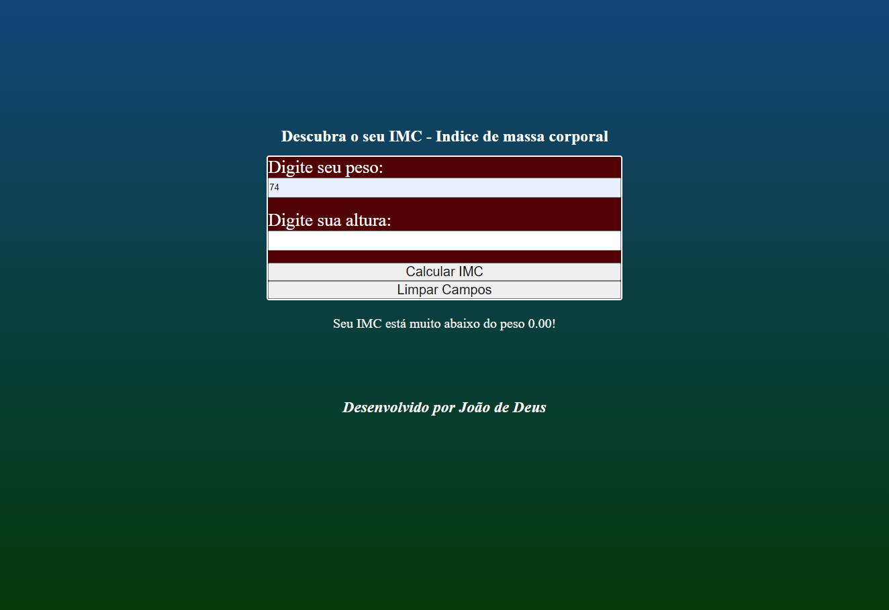

#### Meus Contatos
# 
## Projeto para calular o IMC - indice de massa corporal, projeto criado após um bate papo com meus pais, os mesmos estavam conversando sobre o peso deles, se estaria acima ou abaixo do peso, após esse bate papo tive a ideia de ajudalos a acompanhar essa questão comentada e resolvi desenvolver uma forma deles verificarem a massa corporal deles de maneira simples e rápida.
## <a href="https://hamburgueria-sable-nu.vercel.app/" target="_blank"> Clique aqui para acessar o projeto online

